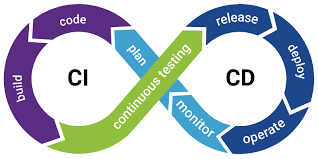

## Nail Your DevOps Interview - CI/CD'

# Table of Contents
- [Table of Contents](#table-of-contents)
  - [1. Introduction ](#1-introduction-)
  - [2. Interview Prep ](#2-interview-prep-)
  - [3. DevOps Business Practices Questions ](#3-devops-business-practices-questions-)
  - [4. Common DevOps Skills ](#4-common-devops-skills-)
  - [5. Cloud services Questions ](#5-cloud-services-questions-)
  - [6. Applications and Services Questions ](#6-applications-and-services-questions-)
  - [7. Wrapping Up your Interview ](#7-wrapping-up-your-interview-)
  - [8. CI Installations ](#8-ci-installations-)

## 1. Introduction 
* Transform your career in DevOps
* What you should know
* DevOps vs. SRE (Site reliability engineer) vs. Automation Engineer
## 2. Interview Prep 
* Preparing for the interview
* Researching the opportunity
* Getting DevOps experience
* Certifications
* Methods for answering questions
* Quiz:
  * Question 1 of 9: During an interview, what is the show-and-tell method most useful for?
  * describing the relation between objects in a system (correct answer)
  * describing bullet points on your resume
  * describing your experience with a particular technology
* Question 2 of 9: When using the story time approach to answering a question, what should the end of your story focus on?
  * The end of the story should focus on results that were achieved through your contributions. (correct answer)
  * The end of the story should focus on why you're looking for a new job.
  * The end of the story should focus on the mistakes made by others that you were able to fix.
* Question 3 of 9: If you are preparing for interviews with a company that is moving to the cloud, what type of certifications should you consider?
  * certifications from programming language vendors (correct answer)
  * certifications from operating system vendors
  * certifications from cloud service providers (correct answer)
* Question 4 of 9: Certifications can improve your position as a candidate.
  * FALSE
  * TRUE (correct answer)
* Question 5 of 9: What approach can you use to keep costs down while getting experience with DevOps tools and cloud platforms?
  * Use proprietary tools and fixed price contracts for cloud platforms.
  * Use your friends' tools.
  * Use open source tools and free tiers for cloud platforms. (correct answer)
* Question 6 of 9: To make sure you're qualified for the job, what should you do?
  * Review the job description and focus on the skill you are 100% qualified for.
  * Review the job description and prepare to answer questions on the skills you are 100% qualified for and those that you may need to improve on. (correct answer)
  * Review the job description and decline to interview for any job that does not line up with your skills and experience.
* Question 7 of 9: During the interview, you should refer to your notes and prepared questions on your mobile device.
  * False (correct answer)
  * True
* Question 8 of 9: Conducting a mock interview with a colleague is the best approach to prepare for interviewing.
  * True (correct answer)
  * False
* Question 9 of 9: What's the best way to start a response to the prompt, "Tell me about yourself"?
  * Describe in detail each position you have held at every company you have worked for.
  * Briefly summarize your professional background. (correct answer)
  * Starting from your childhood, explain how you became interested in your career choice. List the classes and training you took to become qualified in your field.

## 3. DevOps Business Practices Questions 
* Defining DevOps: CAMS
  * Culture
  * Automation
  * Measurement 
  * Sharing
* The DevOps lifecycle
* Lean vs Agile vs DevOps
* CI/CD
  * CI/CD bridges the gaps between development and operation activities and teams by enforcing automation in building, testing and deployment of applications. CI/CD services compile the incremental code changes made by developers, then link and package them into software deliverables. Automated tests verify the software functionality, and automated deployment services deliver them to end users. The aim is to increase early defect discovery, increase productivity, and provide faster release cycles. The process contrasts with traditional methods where a collection of software updates were integrated into one large batch before deploying the newer version.
  * CI/CD process 
* Configuration management
* Monitoring and alerting tools
  * Nagios
  * Sensu
  * New Relic
  * Datadog
* Testing
  * Functional Testing: Selenium, JUnit, Cucumber
    * Unit tests
    * Integration tests
  * Performance Testing: Jmeter, Gatling, Apache Bench.
    * Response tests
    * Load tests - requests from users
* Challenge: Server based deployment to Container deployment???
* Solution:  erver based deployment to Container deployment 
* Quiz:
  * Question 1 of 8: What shape is used to represent the DevOps lifecycle?
    * a square 
    * a circle
    * an infinity symbol (correct answer)
  * Question 2 of 8: Why is testing an important part of continuous integration?
    * Testing helps development and operations teams build a culture of communication. (correct answer)
    * Testing helps to find and resolve problems early in the development cycle.
    * Testing helps generate features for the next release of an application.
  * Question 3 of 8: If an interviewer asks the following question, what could they be trying to determine? "What configuration tools are you most familiar with and how have you used them?"
    * the candidate's experience with tools like Terraform and Cloudformation
    * the candidate's experience with tools like Jenkins, CircleCI, and GitHub Actions
    * the candidate's experience with tools like Ansible, Chef, and Puppet (correct answer)
  * Question 4 of 8: To answer questions about CI/CD, what should you know?
    * How to use all of the CI/CD tools on the market.
    * The main concepts of CI/CD, like building, testing, and deploying. (correct answer)
    * The difference between delivery and deployment.
  * Question 5 of 8: What is the primary benefit of CI/CD?
    * Developers can find and resolve problems more quickly. (correct answer)
    * Software is kept in revision control.
    * Deployments are automated so minimal human interaction is needed.
  * Question 6 of 8: What approach is best for comparing the Lean and Agile software development methods?
    * story time method
    * definition method (correct answer)
    * THX method
  * Question 7 of 8: The acronym C.A.M.S is often used to define DevOps. What do each of these letters stand for?
    * containers, automation, measurement, and shell scripts
    * culture, automation, measurement, and sharing (correct answer)
    * CI/CD, automation, monitoring, and sharing
  * Question 8 of 8: From the following alerts, which of these is most likely to be considered an alarm?
    * The production server's SSL certificate will expire in 30 days.
    * The production server's disk is 100% full. (correct answer)
    * The production server's deployment completed successfully.
## 4. Common DevOps Skills 
* Operating systems: Windows, MacOS or Linux Operating system.
* Command line tools
* Scripting and Programming
* Software version control: Git, gitLab, Bitbucket
* Troubleshooting
* Indent management
* Security
* Quiz:
  * 
## 5. Cloud services Questions 
* Cloud services and their benefits: Scalability
* Architecting cloud solutions
* Infrastructure as code: 
  * Scale and Automation
  * Modularity and Reuse
  * Infrastructure: AWS, Google Cloud, Azure.
* Quiz
  * 
## 6. Applications and Services Questions 
* Web servers: Apache vs NGINX
* Databases
* Containers
* Challenge: Diagramming web architecture
* Solution: Diagramming web architecture (see solution in Pdf file)
* Quiz
  * 
## 7. Wrapping Up your Interview 
* Asking Questions
* Following up
* Quiz

## 8. CI Installations 